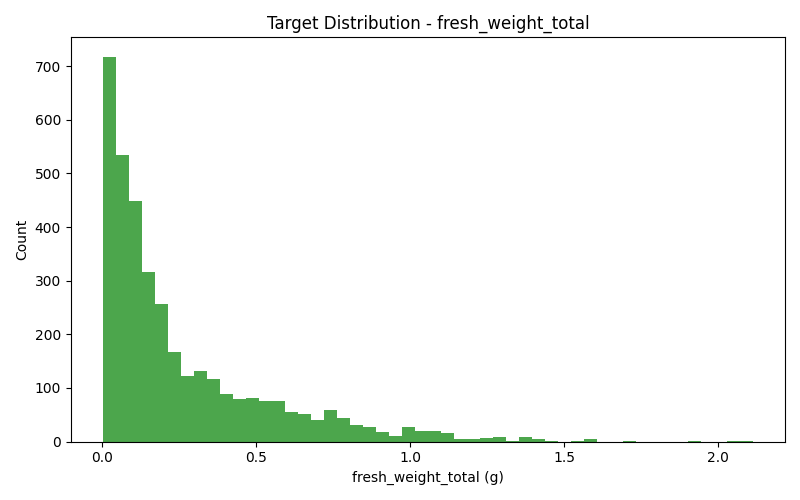
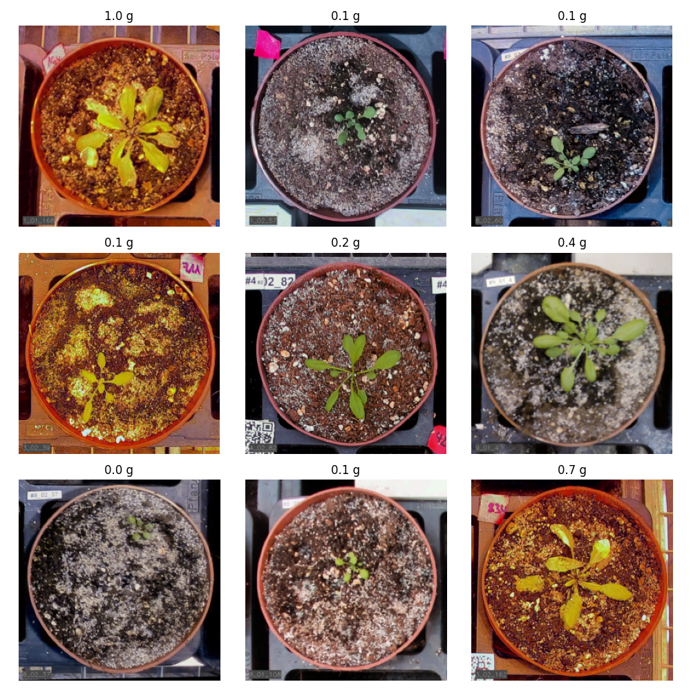
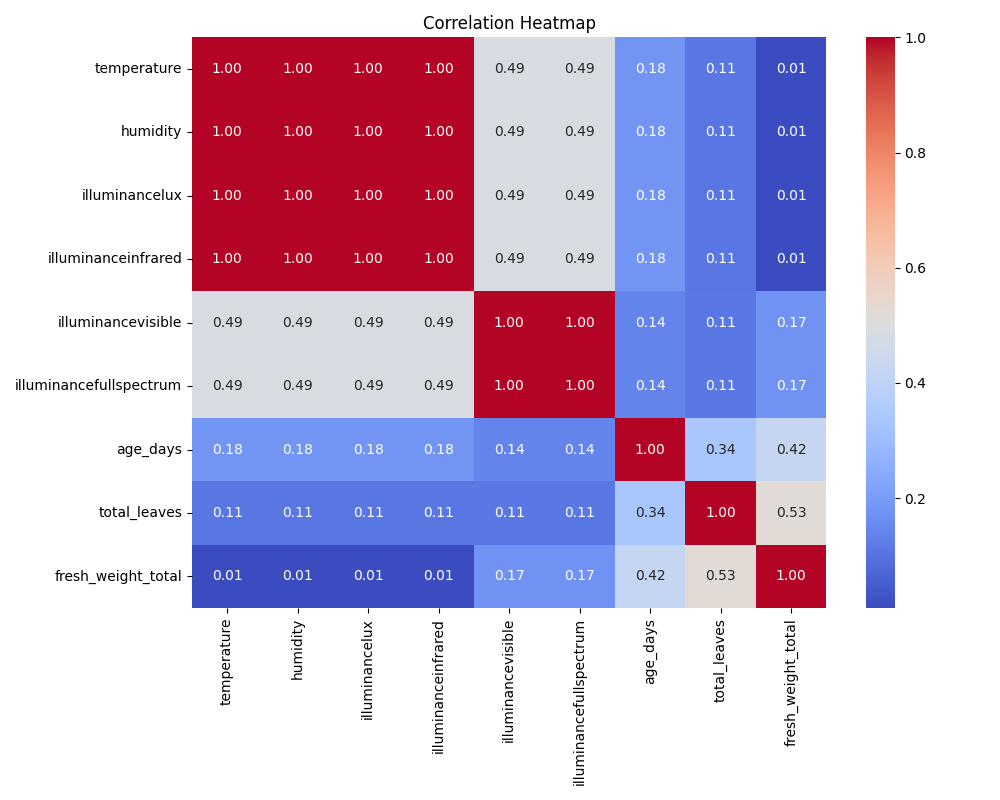
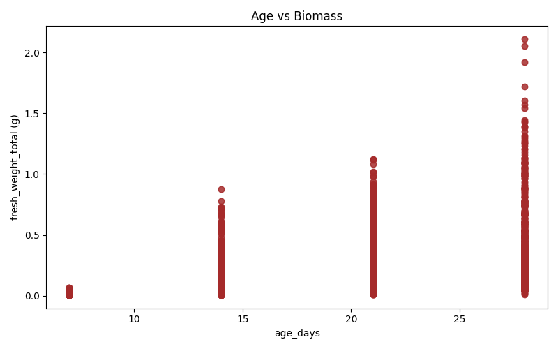
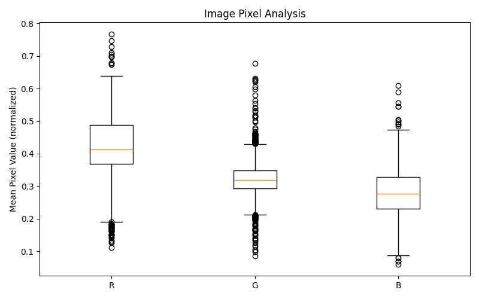
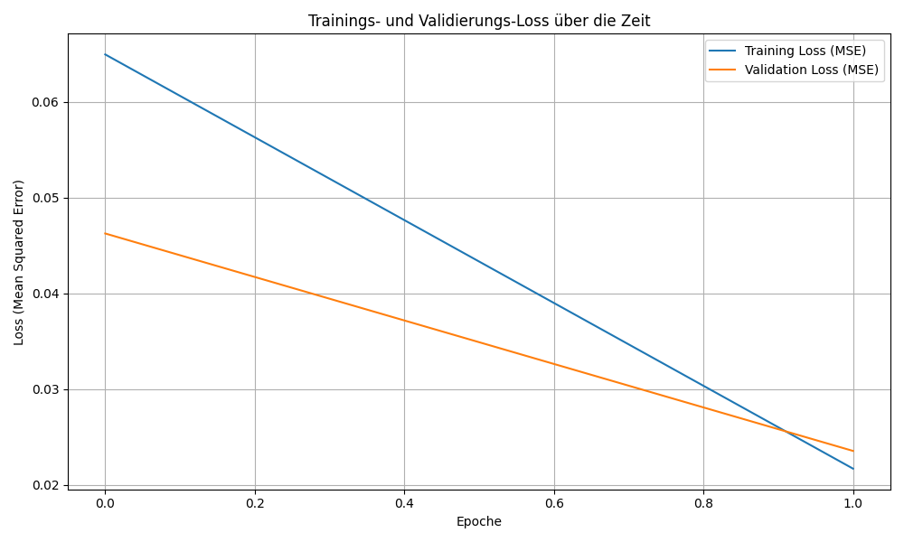

# MLOps Lab Block 1: Biomasse-Vorhersage

In diesem Projekt bauen wir eine Pipeline, um das Gewicht von Pflanzen (`fresh_weight_total`) nur anhand von Bildern vorherzusagen.

## 1. Exploratory Data Analysis (EDA)

Zuerst haben wir uns die Daten angeschaut, um ein Gefühl dafür zu bekommen und Probleme zu finden.

### Verteilung der Zielvariablen (`fresh_weight_total`)

Hier sieht man direkt das erste Problem: Die Daten sind extrem **rechtsschief**. Fast alle Pflanzen wiegen sehr wenig (zwischen 0.0 und 0.25g). Es gibt nur ganz wenige "schwere" Ausreißer. Das könnte für das Training mit MSE schwierig werden, weil diese Ausreißer den Loss stark verzerren.



### Beispielbilder und ihre Labels

Eine zufällige Auswahl von 9 Bildern. Man sieht die Pflanzen in ihren Töpfen. Hier fällt auch direkt **Problem 2** auf: Bei vielen Bildern steht "nan g", d.h. uns fehlen die Labels (Gewichtsangaben) für diese Bilder.



### Korrelations-Heatmap

Wir haben die Zahlen aus der Excel-Tabelle mit dem Zielgewicht korreliert.
* Wenig überraschend: `age_days` (Alter) und `total_leaves` (Blätteranzahl) hängen am stärksten mit dem Gewicht zusammen (Korrelation 0.42 bzw. 0.53).
* Die ganzen Sensor-Daten (Temperatur, Licht, etc.) scheinen kaum einen direkten Einfluss auf das Endgewicht zu haben.



### Biomasse vs. Alter (`age_days`)

Hier sieht man die Korrelation vom Alter nochmal als Scatter-Plot. Je älter die Pflanze, desto schwerer. Interessant ist aber: Die **Streuung (Varianz)** wird mit dem Alter viel größer. Junge Pflanzen wiegen alle fast gleich wenig, während ältere Pflanzen sehr unterschiedlich schwer sein können.



### Bild-Pixelanalyse

Zuletzt haben wir uns die durchschnittlichen RGB-Werte aller Bilder angesehen.
* **Grün (G)** ist am stärksten, da es Pflanzen sind.
* **Rot (R)** ist auch stark, das kommt von der braunen Erde in den Töpfen.
* Die vielen Ausreißer (die Kreise) kommen wahrscheinlich von den unterschiedlichen Lichtbedingungen (mit/ohne künstliches Licht).



### Analyse der Datenqualität

Bei der EDA sind zwei Hauptprobleme aufgetaucht, die wir beheben müssen:

1.  **Fehlende Labels:** Bei vielen Bildern fehlte die Angabe `fresh_weight_total` (man sah es schon bei den Beispielbildern mit "nan g"). Diese Zeilen müssen wir komplett rauswerfen, weil wir damit nicht trainieren können.
2.  **Fehlende Bilder:** Manche Einträge in der Excel-Datei hatten zwar ein Label, aber die zugehörige Bilddatei (`filename`) gab es im `images_med_res/` Ordner nicht. Diese Zeilen müssen natürlich auch raus.

Diese Probleme müssen in der Daten-Pipeline (Schritt 2) behoben werden, bevor wir den Train/Validation-Split machen.

---

## 2. Modellarchitektur & Daten-Pipeline
### 2.1 Daten-Pipeline

Bevor die Bilder ins Modell kommen, durchlaufen sie eine strikte Pipeline (definiert in `train_model.py`):

1.  **Bereinigung:** Alle Samples ohne gültiges Label (Gewicht) oder ohne existierende Bilddatei werden entfernt (siehe "Analyse der Datenqualität").
2.  **Split:** Die bereinigten Daten werden in ein **80% Trainings-Set** und ein **20% Validierungs-Set** aufgeteilt.
3.  **Transformation:** Jedes Bild wird auf **224x224 Pixel** skaliert (Standardgröße für ResNet).
4.  **Normalisierung:** Die Pixelwerte werden auf die Standard-Statistiken (Mittelwert/Standardabweichung) des ImageNet-Datensatzes normalisiert.

### 2.2 Modell: ResNet18 für Regression

Wir verwenden ein **ResNet18**-Modell, das auf dem riesigen ImageNet-Datensatz vortrainiert wurde. Dieses Modell ist ein Experte darin, nützliche Features (Kanten, Texturen, Formen) aus Bildern zu extrahieren.

Da das Originalmodell für Klassifizierung gebaut wurde, mussten wir es für unsere Regressions-Aufgabe anpassen:

* **Basis:** Wir behalten das gesamte vortrainierte ResNet18-Modell als "Feature Extractor".
* **Kopf (Head):** Wir ersetzen den letzten Layer (genannt `fc` oder "fully-connected") durch einen neuen.
* **Ergebnis:** Dieser neue Kopf nimmt diese Features, die das ResNet gelernt hat, und wandelt sie in **einen einzigen Zahlenwert** um: unsere vorhergesagte Biomasse in Gramm.

Als Loss-Funktion (Fehlermaß) verwenden wir den **Mean Squared Error (MSE)**, der typisch für Regressionsprobleme ist.

---

## 3. Trainingsprozess und Hyperparameter

Das Training wurde über das Skript `train_model.py` gestartet.

* **Optimizer:** `torch.optim.Adam`
* **Device:** Das Training lief auf `cuda` (NVIDIA GPU), falls verfügbar, ansonsten `cpu`.
* **Logging:** Der Trainingsfortschritt, die verwendeten Hyperparameter und der Git-Hash wurden in die Datei `training.log` geschrieben.
* **Checkpointing:** Das Modell mit dem **besten (niedrigsten) Validierungs-Loss** wurde automatisch unter `checkpoints/best_biomass_model.pth` gespeichert.

Für den hier dokumentierten Lauf wurden folgende Hyperparameter verwendet:

| Parameter | Wert | Beschreibung |
| :--- | :--- | :--- |
| `EPOCHS` | 1 | Anzahl der Trainings-Durchläufe (sehr niedrig, nur für Funktionstest) |
| `BATCH_SIZE` | 32 | Anzahl der Bilder, die pro Schritt verarbeitet werden |
| `LEARNING_RATE` | `1e-4` (0.0001) | Lernrate für den Adam-Optimizer |

---

## 4. Ergebnisse

Das Ziel war ein funktionaler End-to-End-Lauf, nicht ein perfekt optimiertes Modell. Mit nur 2 Epochen kann das Modell noch nicht generalisieren, aber wir können bestätigen, dass die Pipeline funktioniert.

### Trainings-Verlauf (Loss Curves)

Die `results/training_curves.png` zeigt den Verlauf des MSE-Loss für Trainings- und Validierungsdaten.



*Anmerkung: Bei nur 2 Epochen sind die Kurven nicht sehr aussagekräftig. Man sieht lediglich, dass der Prozess gestartet ist.*

### Finale Metriken

Die Metriken des besten Modells (gespeichert in `results/metrics.txt`) sind:
```
Finale Validierungs-Metriken (bestes Modell):
=============================================
Best Validation MSE: 0.0258
Best Validation RMSE: 0.16 g
```

Der **Validation RMSE** (Root Mean Squared Error) ist die aussagekräftigste Metrik. Sie gibt an, wie viele Gramm das Modell bei seinen Vorhersagen für die ungesehenen Validierungsdaten im Durchschnitt daneben liegt.

---

## 5. Herausforderungen (Challenges)

1.  **Datenqualität:** Wie in der EDA (Schritt 1) gezeigt, war die größte Hürde die Datenbereinigung. Eine große Anzahl von Zeilen hatte entweder kein `fresh_weight_total`-Label oder die zugehörige Bilddatei fehlte. Dies reduzierte die Menge der nutzbaren Daten erheblich.
2.  **Extrem schiefe Target-Verteilung:** Die Zielvariable (Biomasse) ist stark rechtsschief (siehe EDA-Plot). Fast alle Pflanzen wiegen < 0.25g. Ein MSE-Loss wird durch die wenigen "schweren" Ausreißer dominiert, was das Training instabil machen kann.
3.  **Data-Loader `num_workers`:** Beim interaktiven Entwickeln (z.B. in VSCode Notebooks) führte die Verwendung von `num_workers > 0` im PyTorch `DataLoader` zu Multiprocessing-Fehlern. Als Workaround wurde `num_workers=0` gesetzt. Dies löst das Problem, macht aber das Laden der Daten langsamer, da es nicht parallelisiert wird.

---

## 6. Mögliche Verbesserungen

Um die Leistung des Modells signifikant zu steigern, wären dies die nächsten Schritte:

1.  **Target-Transformation (Log-Transform):** Um das Problem der schiefen Verteilung (Herausforderung #2) zu lösen. Man trainiert das Modell, um `log(1 + weight)` vorherzusagen, statt `weight`. Der Loss wird dadurch stabiler. Bei der Inferenz rechnet man das Ergebnis mit `exp(prediction) - 1` zurück.
2.  **Längeres Training & Hyperparameter-Tuning:** 2 Epochen sind nur ein Funktionstest. Ein Training über 30-50 Epochen mit einer systematischen Suche nach der besten Lernrate (z.B. mit einem Learning Rate Scheduler) ist notwendig.
3.  **Nutzung von Metadaten:** Wir haben nur Bilder verwendet. Die EDA zeigte aber, dass `age_days` (Alter) stark mit dem Gewicht korreliert. Ein "multimodales" Modell, das sowohl das Bild (via ResNet) als auch das Alter als Input erhält, wäre wahrscheinlich deutlich stärker.

---

## 7. Instruktionen zur Reproduzierbarkeit

Um die Ergebnisse dieses Projekts zu reproduzieren, folgen Sie diesen Schritten:

1.  Klonen Sie das Git-Repository.
2.  Laden Sie die Daten (`digital_biomass_labels.xlsx` und `images_med_res/`) herunter und legen Sie sie in die  Ordnerstruktur (`2025_10_13_mlops_biomass_data/mlops_biomass_data/`).
3.  Erstellen Sie eine virtuelle Umgebung und installieren Sie die Abhängigkeiten:
    ```bash
    pip install -r requirements.txt
    ```
4.  Führen Sie das Training-Skript aus. Das Skript akzeptiert Argumente für die wichtigsten Hyperparameter.

    **Beispiel: Training mit Standardwerten (z.B. 20 Epochen):**
    ```bash
    python train_model.py
    ```

    **Beispiel: Training mit angepassten Werten:**
    ```bash
    python train_model.py --epochs 30 --batch_size 64 --learning_rate 0.0001 --model_name "resnet18"
    ```
5.  Der Fortschritt wird in `training.log` gespeichert.
6.  Die finalen Artefakte (Plots, Metriken, Modell) werden in den Ordnern `figures/`, `results/` und `checkpoints/` abgelegt.