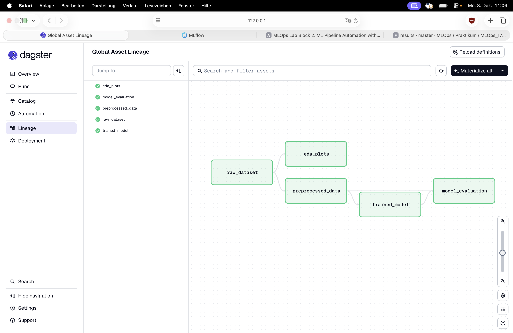
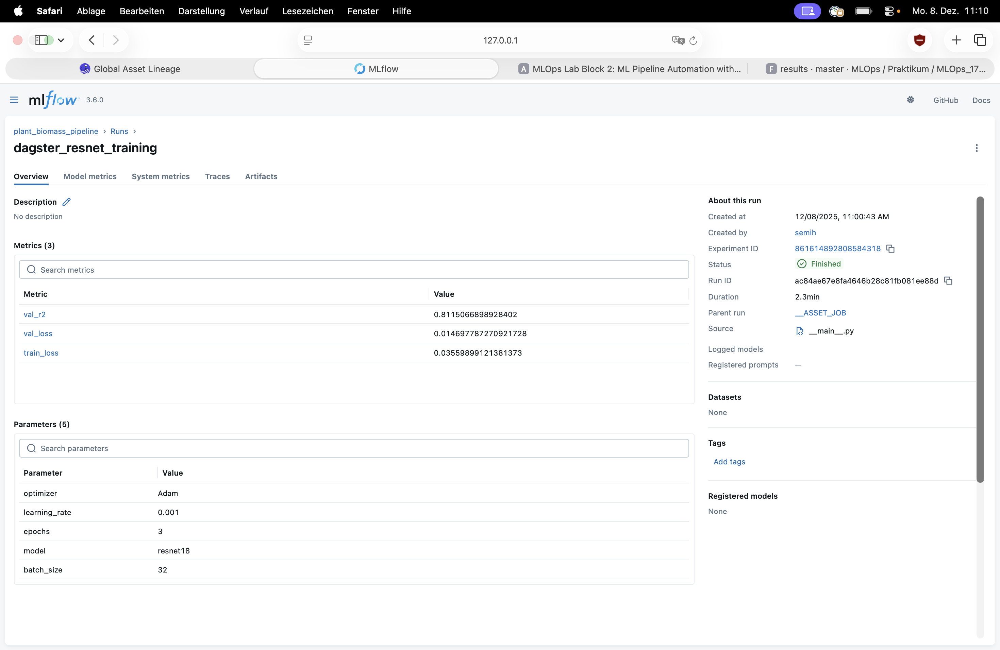
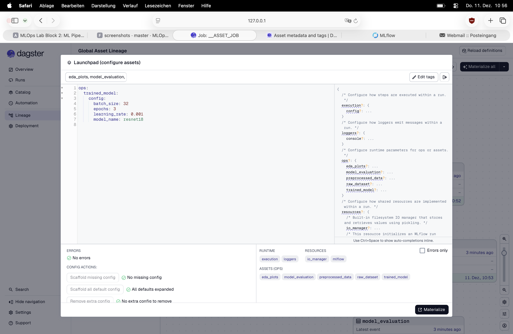
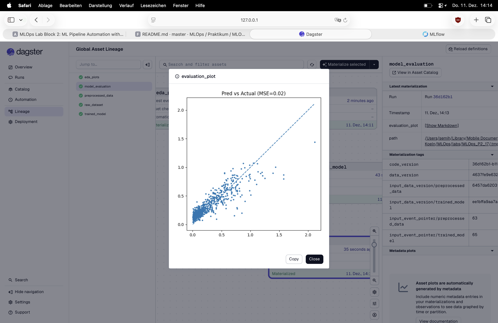

# MLOps Biomasse-Vorhersage-Pipeline

Dieses Repository enthält eine automatisierte Machine-Learning-Pipeline zur Vorhersage von Pflanzenbiomasse.  
Die Pipeline nutzt **Dagster** für die Orchestrierung und **MLflow** für das Experiment-Tracking.  
Sie transformiert Rohbilder und Metadaten in ein trainiertes ResNet-Regressionsmodell.

---

## 1. Pipeline-Architektur

Die Pipeline besteht aus den folgenden Dagster-Assets:

* **raw_dataset**  
  Lädt die Metadaten (Excel) und validiert, ob die Bildpfade auf der Festplatte existieren.

* **eda_plots** (optional)  
  Erstellt Plots zur explorativen Datenanalyse (z. B. Verteilung der Zielvariable) und speichert diese unter `figures/`.

* **preprocessed_data**  
  Passt die Bildgröße an, normalisiert die Bilder, führt einen Train/Validation-Split durch und erstellt PyTorch DataLoaders.

* **trained_model**  
  Trainiert ein ResNet-Modell (ResNet18 oder ResNet50).  
  **Integration:** Nutzt MLflow, um Hyperparameter zu tracken, Trainingsmetriken (Loss, R²) pro Epoche zu loggen und das beste Modell als Artefakt zu speichern.

* **model_evaluation**  
  Lädt das beste Modell, führt Inferenz auf dem Validierungsdatensatz durch, berechnet den MSE (Mean Squared Error) und erstellt einen „Prediction vs. Actual“-Scatter-Plot.

---

## 2. Installationsanleitung

### Voraussetzungen

* Python 3.8 oder höher  
* Virtuelle Umgebung (empfohlen)

### Installation

Installieren Sie die benötigten Abhängigkeiten:

```
pip install dagster dagster-webserver dagster-mlflow mlflow pandas torch torchvision matplotlib openpyxl numpy
```

oder 

```
pip install -r requirements.txt
```

Stellen Sie sicher, dass der Datensatz im Hauptverzeichnis (Root) mit der folgenden Struktur vorhanden ist:

`MLOps_P2_17/2025_10_13_mlops_biomass_data/mlops_biomass_data/digital_biomass_labels.xlsx`

`MLOps_P2_17/2025_10_13_mlops_biomass_data/mlops_biomass_data/images_med_res/`

## 3. Ausführen der Pipeline
Um die Pipeline korrekt auszuführen, müssen zwei Dienste in separaten Terminal-Fenstern gestartet werden.

### Schritt 1: MLflow Tracking Server starten

Dieser Server übernimmt das Logging der Experimente.

```mlflow server --port 5001```

Zugriff auf die UI: http://localhost:5001

### Schritt 2: Dagster Dev Server starten

Dieser Befehl startet den Dagster Daemon und die Weboberfläche.

```dagster dev -f dagster_pipeline.py```

Zugriff auf die UI: http://localhost:3000

### 3. Ausführung

1. Öffnen Sie die Dagster UI unter http://localhost:3000.

2. Navigieren Sie zum Tab Assets (oder Lineage).

3. Klicken Sie oben rechts auf "Materialize all", um die gesamte Pipeline auszuführen.

### 4. Ergebnisse
Getrackte Parameter & Metriken

Das Asset ``trained_model`` loggt Folgendes in MLflow:

1. **Parameter**: ``epochs``, ``batch_size``, ``learning_rate``, ``model (z. B. resnet18)``, ``optimizer``.

2. **Metriken**: ``train_loss``, ``val_loss``, ``val_r2``.

3. **Artefakte**: Die Gewichte des besten Modells (best_model_mlflow.pth).

### 5. Evaluierung

Nach einem erfolgreichen Durchlauf werden die Ergebnisse **lokal** gespeichert:

**Metriken**: results/metrics.txt (enthält den Validierungs-MSE).

**Plots**: results/pred_vs_actual.png und figures/target_distribution.png.


#### Screenshots

**Dagster Lineage (Erfolgreicher Durchlauf):**  


**MLflow Experiment Tracking:**  


**Dagster Config:**  


**Dagster Markdown Plot:** Zum einsehen des Plots muss man auf das asset model_evaluation klicken und unter evaluation_plot auf "Show Markdown"


